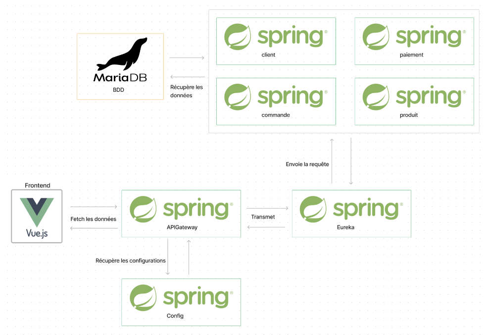

# TP Micro Service
``` Barbary Théo, Thiry Basile, Cogo Clément ```

Ce projet est une application Spring Boot qui inclut plusieurs microservices pour démontrer une architecture de système distribué.

## Docker

Un fichier Dockerfile est présent dans le répertoire courant du projet pour permettre de construire une image Docker qui installe tous les besoins nécessaires pour exécuter l'application Spring Boot avec Vue.js


1. Construisez l'image Docker en exécutant la commande suivante :

            docker build -t projet-microservice 
            
2. Démarrez l'image Docker en exécutant la commande suivante :

            docker run -p 8761:8761 -p 8080:8080 -p 9411:9411 project-microservice

Cela va démarrer l'application Spring Boot ainsi que les services Eureka, gateway, Zipkin, et exposer les ports nécessaires pour y accéder depuis l'extérieur.

Accédez à ``http://localhost:3000`` dans votre navigateur pour accéder à l'application.

## Informations

En cas de problèmes ou d'erreur lors du lancement du docker, veuillez lancer les applications dans l'ordre suivant :

      1. Springboot Eureka : Eureka
      2. Springboot Config : Config
      3. Springboot Gateway : APIGateway
      4. Springboot Client : microserviceclients
      5. Springboot Commandes : microservicecommandes
      6. Springboot Paiements : microservicepaiements
      7. Springboot Produits : microserviceproduits
      8. Application front : 
         - cd frontend/
         - npm run serve

Comme dit auparavant, vous pourrez accéder à l'application via l'URL : 
       
      http://localhost:3000/Vous ne devriez pas avoir à vous occuper de la base de données vu que cette dernière est hostée sur l'un de nos serveurs

Vous ne devriez pas avoir à vous occuper de la base de données vu que cette dernière est hostée sur l'un de nos serveurs

Schéma global de l'application :
